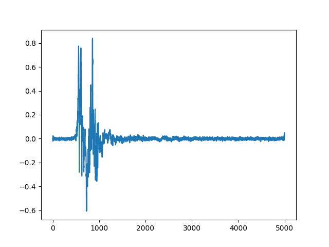

# Dataset 1a Shock Test GAN Model
Generating model trained on Dataset 3

## Usage
Python 3.9 is the recommended python version

### Required Packages
* Numpy
* TensorFlow

### Calling the Script

Two methods:
* python main.py
* ./main.sh(*)

(*) This method may fail if OS doesn't allow local scripts. The commands to allow local scripts can be found online, but one can be found in access_scripts/
### Command Line Arguments
--model_path: Relative file path from program to model. i.e. "./model_dir"

--n/--number_of_signals: Number of signals to generate. All signals are stored in the same file.

--labels: Labels to use for signal synthesis. Labels can be integers (0, 1, or 2), or comma
            separated string representing which accelerometer types to use (i.e. '0, 0, 1, 0) for
            accelerometer 3.

--output: Path to where signals will be saved. Current supported file types .txt and .npy

-w: Whether to overwrite the file if it exists. Include this flag to overwrite

### Examples

python main.py --output synth.txt

python main.py --model ./conditional_af_accel_generator_v3 --n 42 --output foo.npy -w

./main.sh --n 2 --labels 0

## Example Figures

## License

This work is licensed under a Creative Commons Attribution-ShareAlike 4.0 International License.

## Citing
Cite this data as:

Zhymir Thompson, Austin Downey, Jason Bakos, Jie Wei, Jacob Dodson, “Dataset 1a Shock Test GAN Model,”
Apr. 2022. [Online]. Available: https://github.com/High-Rate-SHM-Working-Group/Dataset-1a-Shock-Test-GAN-model

@Misc{Thompson2022Dataset1aShock,   
  author = {Zhymir Thompson and Austin Downey and Jason Bakos and Jie Wei and Jacob Dodson},    
  month  = apr,   
  title  = {Dataset 1a Shock Test {GAN} Model},   
  year   = {2022},    
  groups = {High-Rate-SHM-Working-Group},   
  url    = {https://github.com/High-Rate-SHM-Working-Group/Dataset-1a-Shock-Test-GAN-model},    
}

